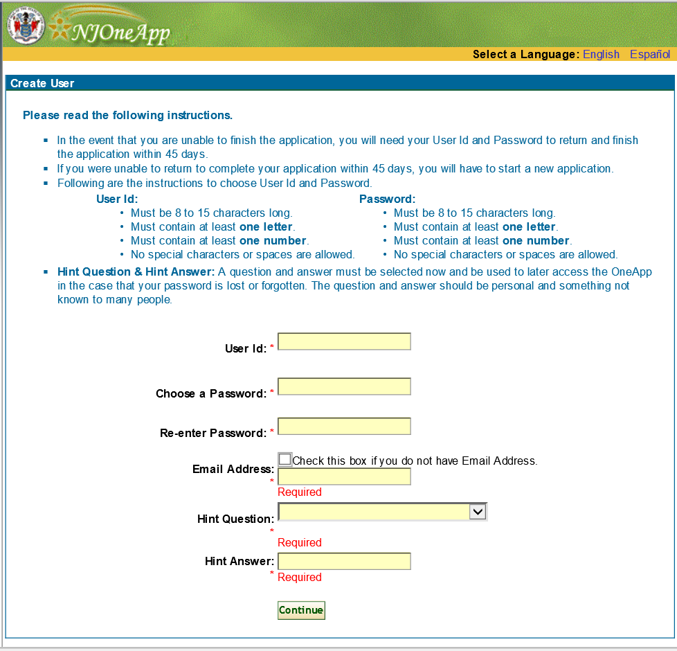
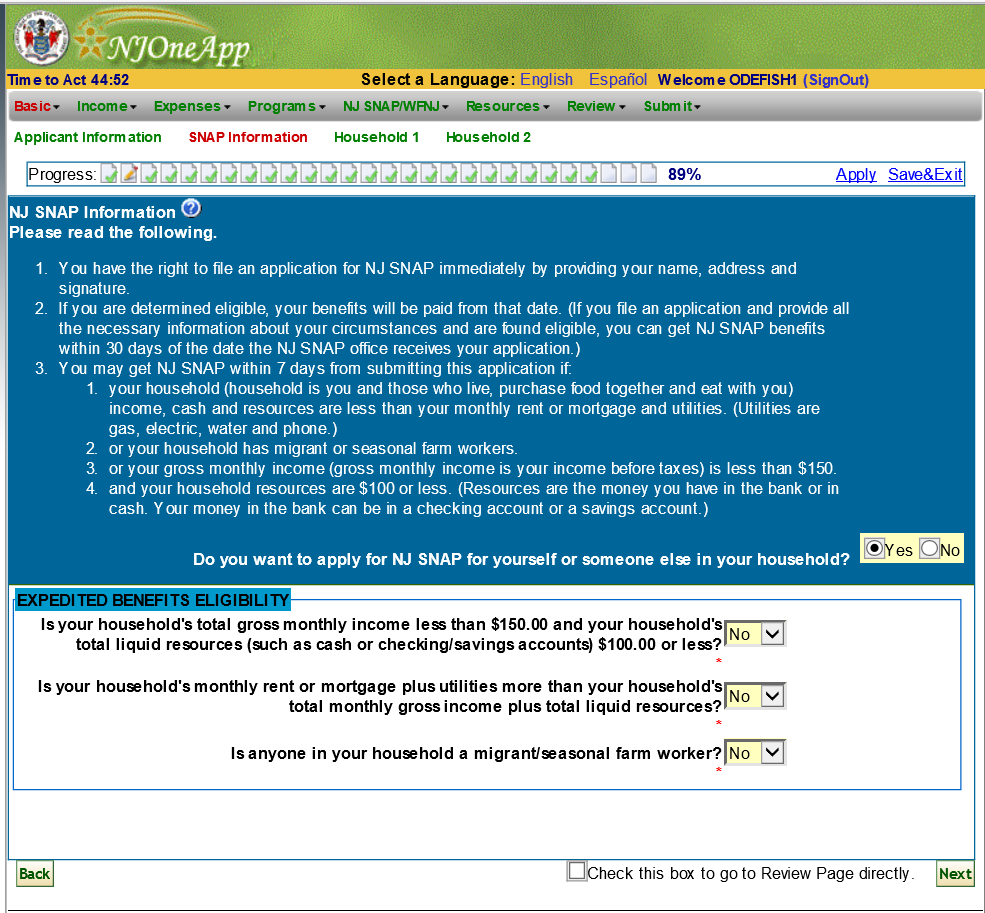
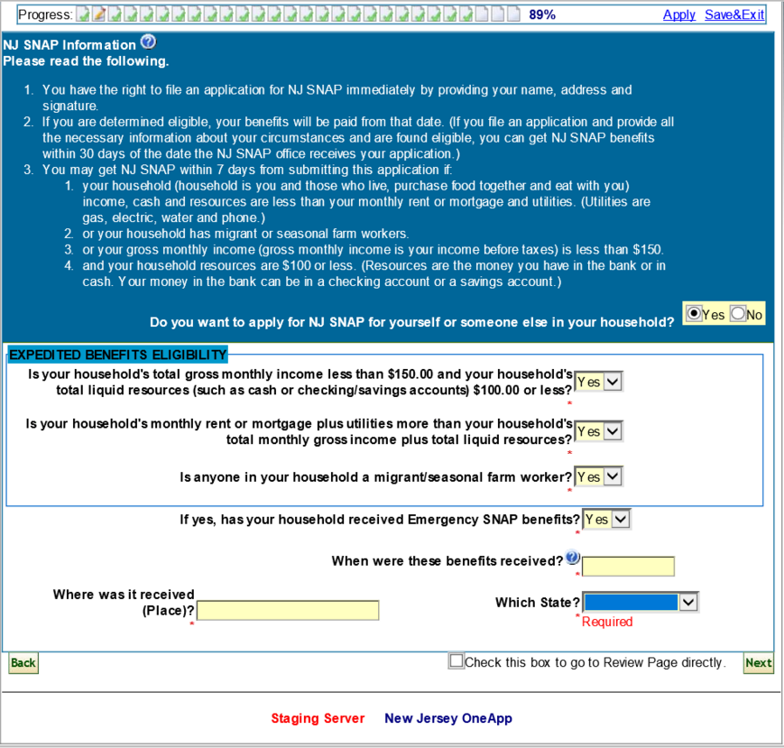
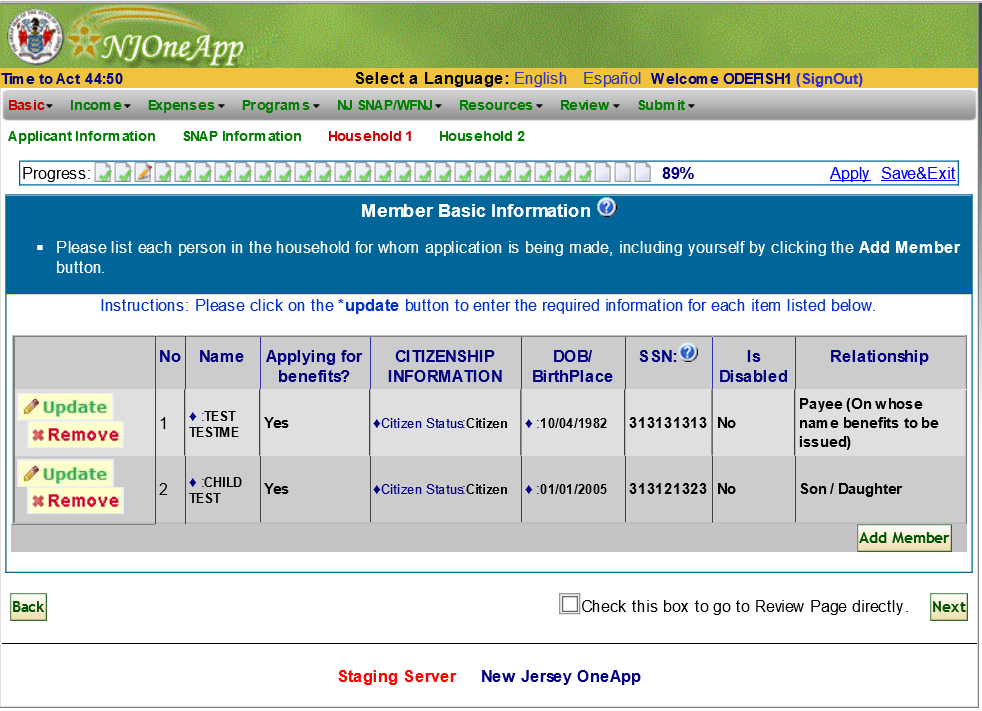
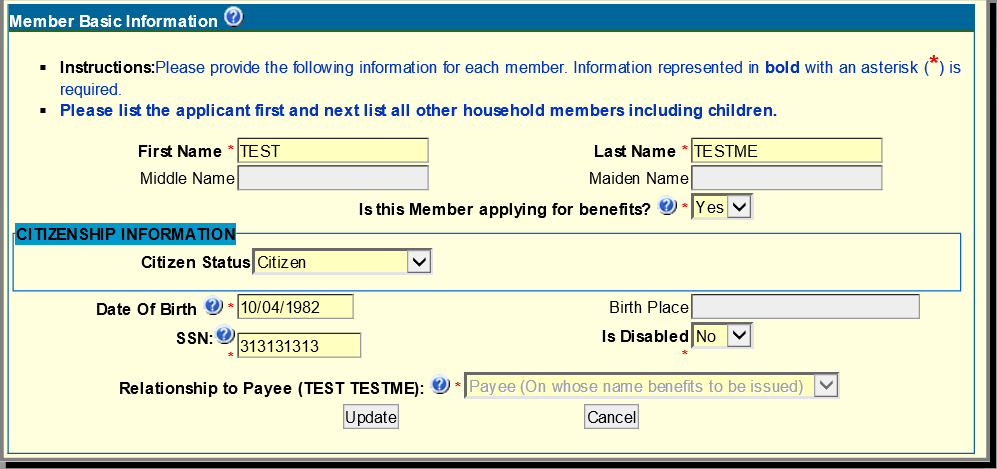
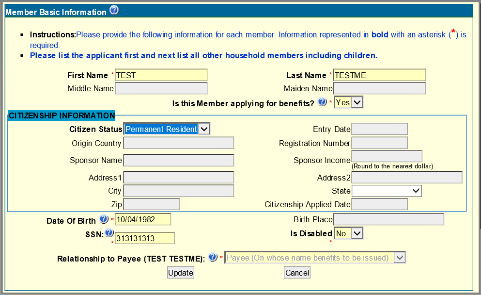
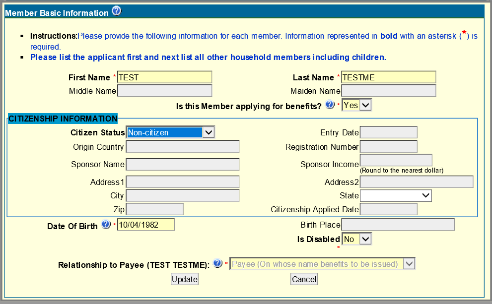
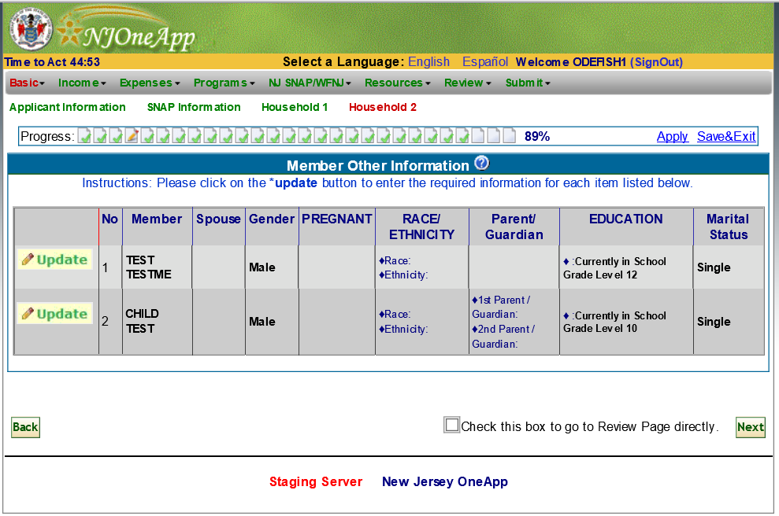
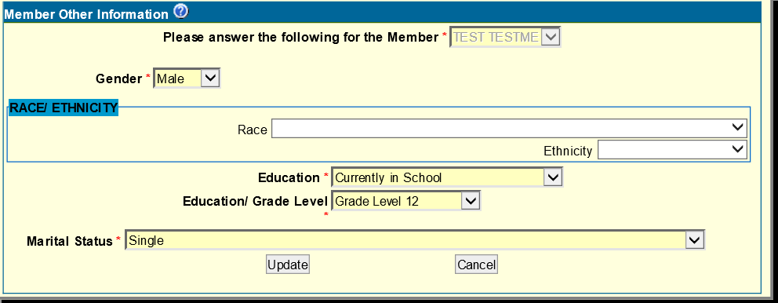
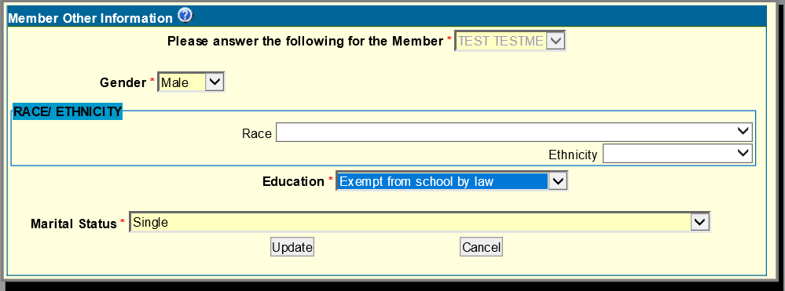

# *Authentication*

### **Userid requirements**
### 1.	Must be 8 to 15 characters long
### 2.	Must contain at least one letter
### 3.	Must contain at least one number
### 4.	No special characters or spaces are allowed   

### **Password**
### 1.	Must by 8 to 15 characters long
### 2.	Must contain at least one letter
### 3.	Must contain of least one number
### 4.	No spaces characters or spaces are allowed   

### **Required fields (All fields are required if the email address checkbox is checked. If the checkbox is unchecked 4, 5, and 6 are not displayed.)**
### 1.	UserId
### 2.	Choose Password
### 3.	Re-enter Password
### 4.	Email Address (if checkbox is checked all remaining fieds are required)
### 5.	Hint Question
### 6.	Hint Answer   

### **Email address** 
### 1.	Email address is passed to the Contact screen when entered here.
### 2.	General email validation    

# *Basic* 
### **Application Information**   

### 1. Question: Are you the Payee?
### 2. A no response to #1 above opens additional fields for the client to enter the First and last name of the payee  
### 3. For Homeless only county is required for address 
### 4. The error text "The entered zip code does not exist in the selected county" is a database validation message that is displayed when the entered zipcode is incorrect. It was created because there are zip codes that boarder multiple counties.
### 5. A Person with no contact information (Address, phone number, or email) must check the checkbox "By checking this box I understand that I must visit my Local County Welfare Office after submitting this application in order for the application to be processed."
### 6. The GetCounty button calls the USPS Webservice located at DHS.
### 7. Required fields/questions are First Name, Last Name, "Are you the Payee?", Street Address, City, Zip (Resident & Mailing) County (this is required for both address and homeless), Primary Phone.
### 8. Invalid area codes are 200, 300, 400, 411, 710, 844, 855, 866, 877, 888, 900, and 911.
### 9. The first and forth phone number position can not be 0 or 1.  

## **SNAP Header**

### 1. A yes response for question "Do you want to apply for NJ SNAP for yourself or someone else in your household?" sets the Program NJ SNAP as the default.
### 2. Required questions are "Is your household's total gross monthly income less than $150.00 and your household's total liquid resources (such as cash or checking/savings accounts) $100.00 or less?", "Is your household's monthy rent or mortgage plus utilities more than your huosehold's total monthly gross income plus total liquid resources?", and "Is anyone in your household a migrant/seasonal farm worker?"
### 3. If the question, "Is anyone in your household a migrant/seasonal farm work?" has a response of yes the question "If yes, has your household received Emergency SNAP benefit?" will become visible. All fields/dropdowns under the newly displayed question are required. 

*NOTE: If an application doesn't have the DFD Program NJ SNAP chosen it is not sent to OneTrac.*

## **Household 1**

### 1. The Citizen Status field controls fields that are displayed on the screen.
### 2. Only the Citizen and Permanent Resident screens have SSN.
### 3. SSN must have standard validation before submitting
### 4. Dates must have standard validation before submitting
### 5. Required fields/questions are first name, last name, Is the Member applying for benefits?, Date of Birth, Is Disabled, and Relationship to Payee.
### 6. Only one payee must exist.
### 7. Currently FAMIS can have up to 26 members in a family (May be a question for future if more are needed)

## **Household 2**

### 1. Education option "Currently in School" and "Completed/Discontinued Education" has the field "Education Grade Level" displayed on screen. All remaining options do not have this field displayed.
  
# *Income*
## **Earned Income**

## **Unearned Income**

## **Other Money Received**
  
# *Expenses*
## **Housing Cost**

## **Medical**

## **Dependent Care**

## **Child Support**

  
# *Programs*

  
# *NJ SNAP/WFNJ*
## **SNAP Header**

## **SNAP Detail**

## **Student Income**

## **Income History**

## **Utilities**

## **Other Individuals**

## **Auth Rep**

## **Criminal History**

  
# *Resource*
## **Resources**

## **Pending Claims**

## **Sell/Trade**

## **Real Estate**

## **Personal Property**

  
# *Review*

  
# *Submit*